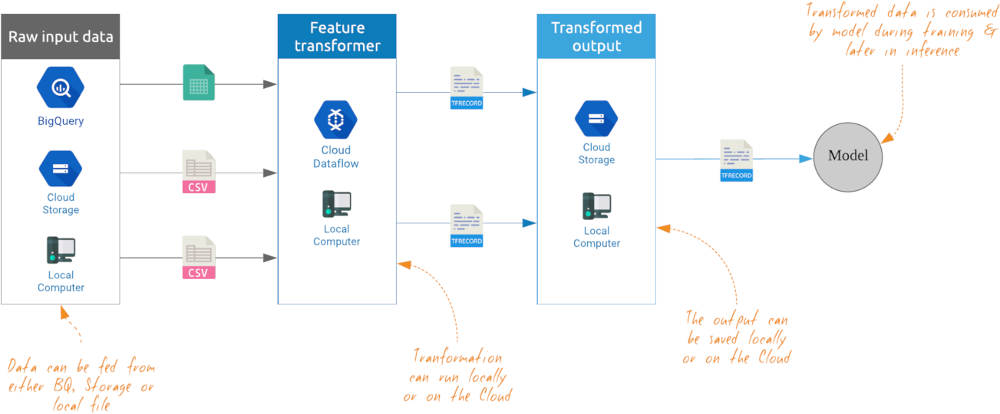
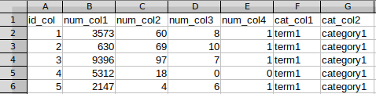
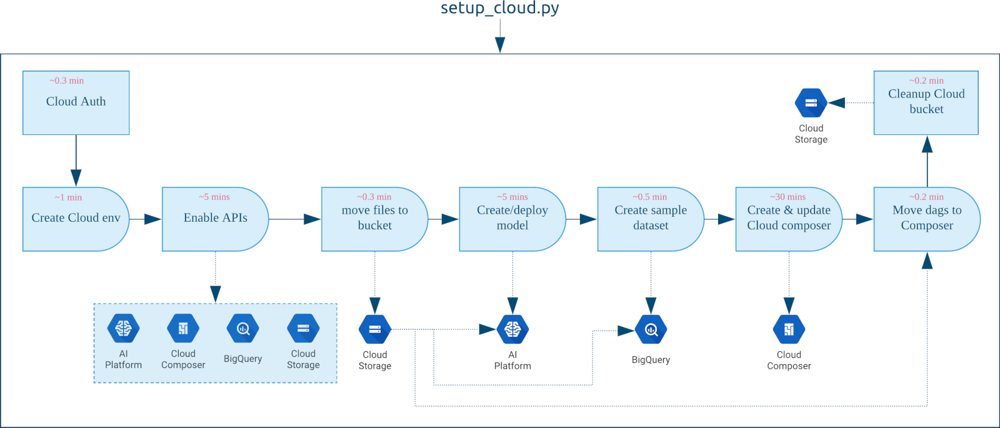
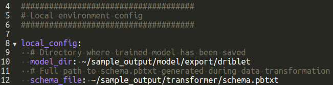
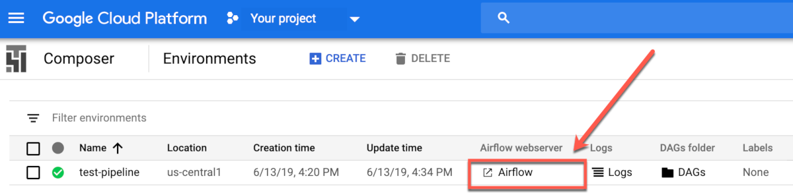
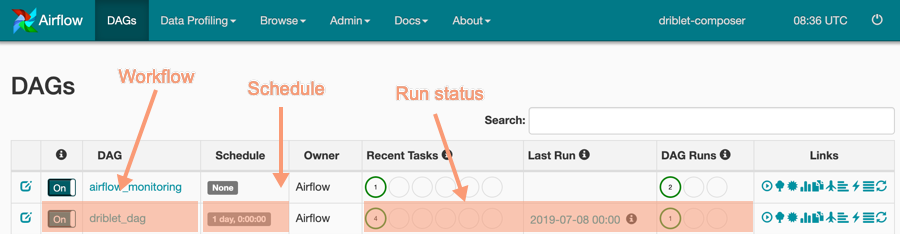
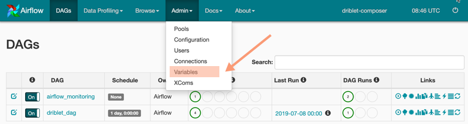
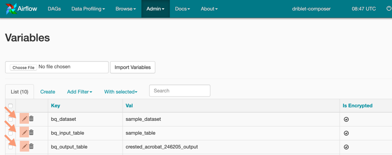

# Driblet - Google Cloud based ML pipeline

*   [Overview](#overview)
*   [Step 1: Environment setup](#step-1-environment-setup)
*   [Step 2: Data Preprocessing](#step-2-data-preprocessing)
*   [Step 3: Model training](#step-3-model-training)
*   [Step 4: Cloud services setup](#step-4-cloud-services-setup)
*   [Step 5: Airflow configuration](#step-5-airflow-configuration)

## Overview

Driblet is a Cloud based framework that 'partially' automates machine learning
pipeline for *structured data*. It 'partially' automates, because modeling is
not part of the automated pipeline and should be done manually, though modeling
doesn't require building model from scratch.

In general, there are 4 steps to run end-to-end pipeline:

1.  Preprocess datasets (train/eval/test)
2.  Train the model based on provided model template
3.  Setup Cloud environment
4.  Configure Airflow variables

Following shows high level pipeline workflow:


First, set up Google Cloud and Python environments.

## Step 1: Environment setup

1.  Select or create a Google Cloud Platform project -
    [link](https://console.cloud.google.com/projectcreate?).
2.  Clone Driblet repository and place it in `~/driblet` directory. Clicking
    following button will do it for you.

    [](https://console.cloud.google.com/cloudshell/open?git_repo=https://github.com/google/driblet)

3.  Create Python environment by executing following command:

```
cd driblet && chmod +x virtualenv.sh && bash virtualenv.sh && \
  source ~/driblet-venv/bin/activate && python setup.py develop
```

This will do following 3 stpes:

1.  Create Python virtual environvment
2.  Activates it
3.  Install all required Python packages.

NOTE: Proceed to the next section only after above command has been successfully
executed.

## Step 2: Data preprocessing

Dataset needs to be preprocessed to be able to train the model. All
preprocessing jobs are handled by
`workflow/dags/tasks/preprocess/transformer.py`.

NOTE: Data preprocessing pipeline expects the dataset already be split into
`train, eval and test` datasets. If your data is in BigQuery, you can use steps
described in
[this page](https://www.oreilly.com/learning/repeatable-sampling-of-data-sets-in-bigquery-for-machine-learning).
Otherwise you can use
[Tensorflow Datasets Splits API](https://www.tensorflow.org/datasets/splits).



Following is step by step guide on how to run the data preprocessing pipeline.

#### 1. Configure features

Edit
[workflow/dags/tasks/preprocess/features_config.py](workflow/dags/tasks/preprocess/features_config.py)
to configure feature columns in your dataset. This file contains feature names
for dummy dataset based on `workflow/dags/tasks/preprocess/test_data/`. If you
check details of one of the CSV file, you will see that it has multiple features
like



`ALL_FEATURES` variable in contains all column names from the CSV. So, you need
to modify following global variables to match your dataset features.

*   `ALL_FEATURES`: All feature columns in dataset
*   `TARGET_FEATURE`: Column with target values
*   `ID_FEATURE`: Column with unique ids
*   `EXCLUDED_FEATURES`: Features to exclude from training
*   `FORWARD_FEATURE`: Feature to be exported along with prediction values.
*   `CATEGORICAL_FEATURES`: Features with categorical values

*NOTE: There is no need to modify `NUMERIC_FEATURES` as it's automatically
generated based on above variables.*

When above is done, move on to next step.

#### 2. Run preprocessing pipeline

Follow steps described in
[Data Preprocessing Guide](workflow/dags/tasks/preprocess/README.md) to
preprocess data before training the model.

## Step 3: Model training

Model expects `.tfrecord` files for train/eval/test datasets. For detailed guide
on how to train model, refer to [Model Training Guide](trainer/README.md).

After model training has been finished, move to next step to setup cloud
environment to run the pipeline.

## Step 4: Cloud services setup

Cloud environment setup involves 9 steps which is done by `setup_cloud.py`. Step
by step process is shown on below image:



There are two steps needs to be done before starting cloud environment setup
process with `setup_cloud.py`. Before running the script, update `model_dir` and
`schema_file` fields in `configuration.yaml`.



Then run python script to kick start cloud environment setup process:

```bash
python setup_cloud.py
```

This will take ~40 minutes to finish. When it succeeds, move to the next step.

## Step 5: Airflow configuration

1.  Go to
    [Google Composer Web UI](https://console.cloud.google.com/marketplace/details/google/composer.googleapis.com)
    and launch Airflow Web UI to manage the workflow.

    

    Now you have an access to Airflow. This manages whole predictive workflow:

    

2.  Change BigQuery dataset and tables to yours. To do so, follow the steps:

    2.1. Click Admin - > Variables

    

    2.2. Click edit icons and set values

    *   `bq_dataset`: Name of your dataset in BigQuery
    *   `bq_input_table`: Name of the table under the dataset. This data will be
        used for prediction.
    *   `bq_output_table`: Name of the table that prediction will be copied to.
        If you don't set, by default, `driblet_output` table will be created
        under your BigQuery dataset.

        

If everything went on well, you’ll see success status in Airflow Web UI


